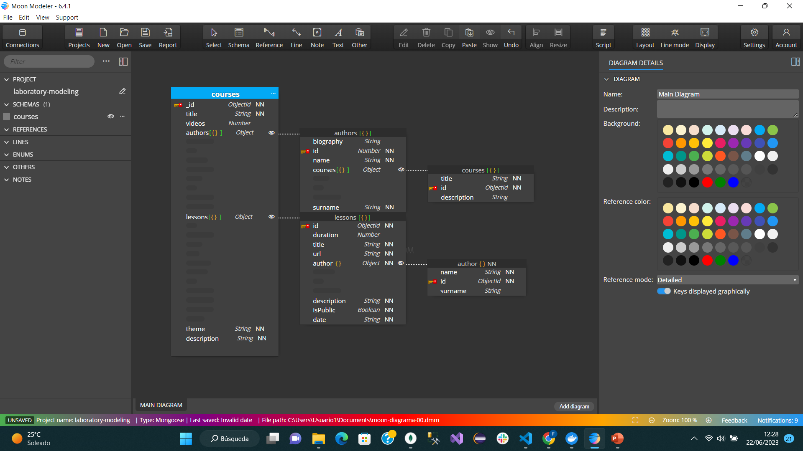

# Data Structure - Tree Pattern and Extended Reference Pattern

This repository utilizes the Tree Pattern to organize and represent data in a hierarchical structure. The data is structured as a collection of JSON objects, each containing various properties and relationships.

## Structure Overview

In this example the main structure consists of a course titled "React with Joe", which contains information such as the course title, number of videos, theme, and description. The course can also includes a set of lessons, with each lesson having properties like duration, title, URL, description, and if it is public or not. Lessons are associated with the author.

## Image

## Link HTML

http://127.0.0.1:5500/basic-modeling-00/content/index.html

## Pattern Explanation

The data structure in this project follows the Tree Pattern and Extended Reference Pattern, representing for first one hierarchical relationships in the entities. The course serves as the root node, with authors and lessons as child nodes. This nested structure allows for organized and efficient data representation.

The Tree Pattern offers benefits such as easy data navigation, parent-child relationships, and flexibility in handling complex structures. It enables seamless querying and manipulation of the data, supporting scalability and logical organization.

In this case using the Tree Pattern for this project achieves a structured and scalable approach to managing and retrieving course-related information.

For the second one, The Extended Reference Pattern insteadof save all complete data about lessons, we save just the identifier (ObjectId) of lessons where the subscriber is subscribed.
